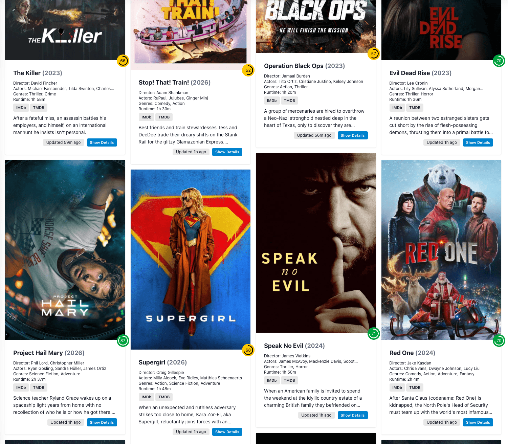
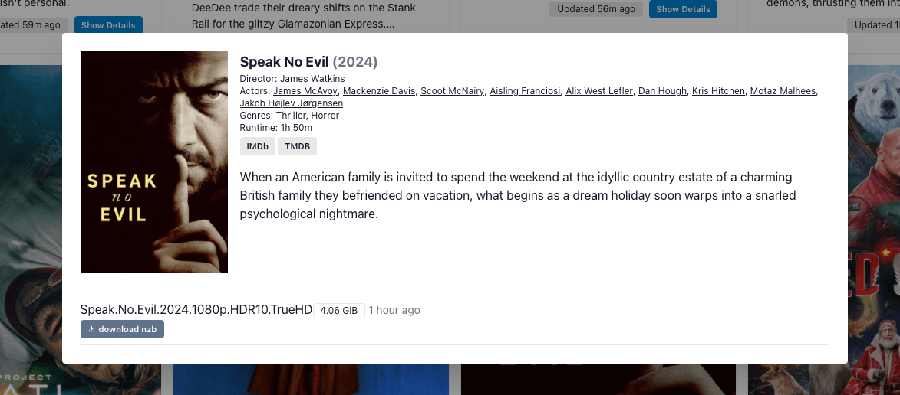

# Newznabber
An NZB indexer, self-hosted and dockerized for your personal, premium newznab movie feeds. Add your feeds, and Newsnabber will index 
them for you. Enriched with metadata from TMDB, it lets you search for movies based on title, director, actor and range of years (start
and end year).

Each movie will list links to download the NZB files that your newznab feed provides. Everything is self-hosted and stored locally.

Your feeds will be downloaded once per hour, and they will be processed (indexed) every 15 minutes.

**Newznabber is intended for personal use only. It uses your own API keys to access the newznab feeds, and access is not restricted. 
Do not host it publicly.**





## Getting started

Newznabber requires:

1. One or more newznab API feeds
2. A (free) TMDB API key

When you have cloned the repository, copy the `.env.example` file to `.env` and fill in the values.

Example newznab feed: https://api.some-usenet-indexer.com/api?apikey=cdhrfer45993sdfe98tgg&t=movie&cat=2040,2045&extended=1

You can get the link to your newznab feed from your indexer's settings, which will also contain the API key. Newznabber only supports
movies, so pay attention to the category filter in the URL: `t=movie&cat=2040,2045`. Also, `extended=1` is required.

After creating and starting the containers, run:
```bash
docker exec newznabber-app composer install
docker exec newznabber-app php artisan migrate --force
docker exec newznabber-app php artisan storage:link
```

If you wish to bind mount the 'db' directory for the database, create it first.

When the containers are up and running, run the following command to generate the application key:

```bash
docker exec newznabber-app php artisan key:generate --show
```

Copy the key and paste it in the .env file after the APP_KEY item, so it looks like this:

```bash
APP_KEY=PUT_YOUR_KEY_HERE
```

Then restart the containers.

## Disclaimer

Newznabber does not download or host movies or copyrighted content. It only indexes NZBs from your newznab feeds.